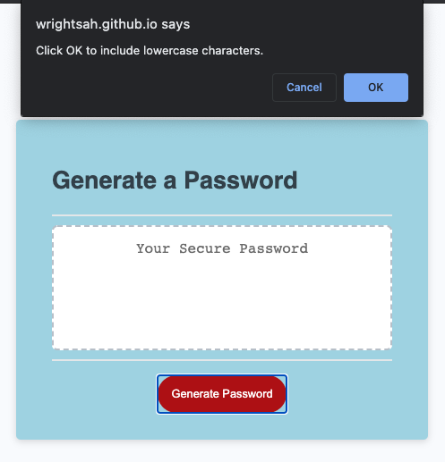
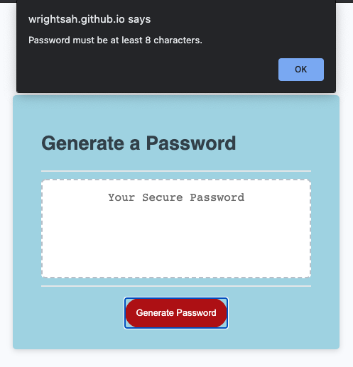

# HW3: Password Generator

## The Project

[View Application Here](https://wrightsah.github.io/homework-3/)

This site was built to generate a secure password that incorporates uppercase characters, lowercase characters, numeric characters, and special characters. 

### Instructions: 

The user will press "Generate Password" to the being the process. Confirmation boxes will prompt for password length (between 8 and 128 characters) and types of characters to include. 

<!-- screenshot 1 -->

### Parameters:

Required parameters are established within the code to ensure that prompts are answered appropriately. 

For example if a user selects a password that is too short (< 7 characters), an error message will be returned. 

<!-- screenshot 2 -->

## Requirements

This website requires a web browser such as Safari, Firefox, Chrome, or Opera to view and run. 

## Credits

HTML & CSS layouts were provided by UNC Coding Bootcamp. 

## Contact

You may contact me at wrightsah@icloud.com

## License

This project uses the following license: [MIT License](License)
